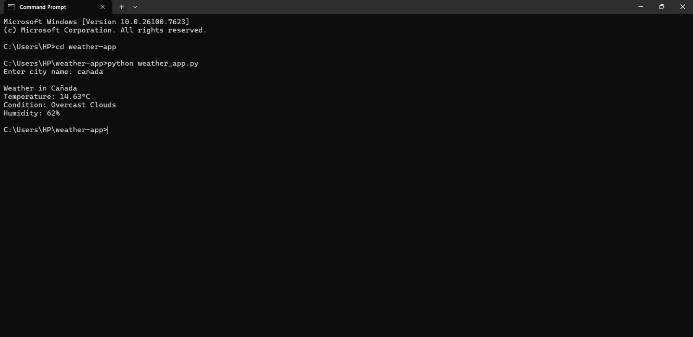

# 🌦️ Weather App (Python)

A simple Python application that fetches real-time weather data using a public API.

## 🔧 Features
- Get weather details by city name
- Displays temperature, condition, and humidity
- Clean and beginner-friendly Python code

## 🛠️ Tech Stack
- Python
- OpenWeatherMap API
- Requests library

## 🚀 How to Run
1. Clone the repository
2. Install dependencies:
3. Add your API key in `config.py`
4. Run the app:

## 🌱 Learning Outcome
- API integration
- JSON handling
- Writing clean Python code

## 📸 Sample Output

